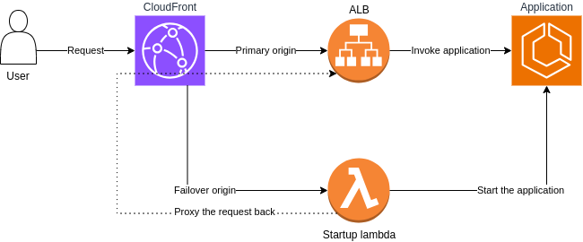

# ECS Scale to zero

Sample application and source code demonstrating how to achieve scale to zero in Amazon Web Services.

## Using CloudFront

The behavior is described in post on [Medium](TODO). Read for more info.

Deployment is implemented in the [src/deploy-cf.ts](src/deploy-cf.ts) file. The startup lambda is implemented in [src/start-lambda.ts](src/start-lambda.ts)

Diagram of the whole architecture:

